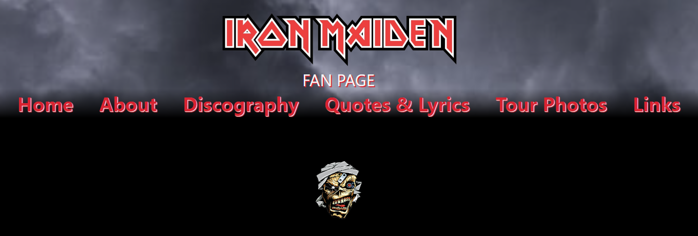

# Iron Maiden Fan Website

## Table of contents

- [Overview](#overview)
  - [Screenshot](#screenshot)
  - [Links](#links)
- [My process](#my-process)
  - [Built with](#built-with)
  - [What I learned](#what-i-learned)
  - [Continued development](#continued-development)
- [Author](#author)

## Overview

### Screenshot

## My process

### Built with

- Semantic HTML5 markup
- CSS
- Flexbox
- CSS Grid

### What I learned

This is an Iron Maiden fan website created for an HTML/CSS exercise during my time in coding bootcamp. I created it from scratch based on the requirements of the assignment. I am actively adding to this website as I learn.

### Continued development

I plan to continue improving this website with responsive design for mobile/tablet/desktop as well as adding some features using JavaScript.

## Author

- Website - [My GitHub](https://github.com/micamash)
